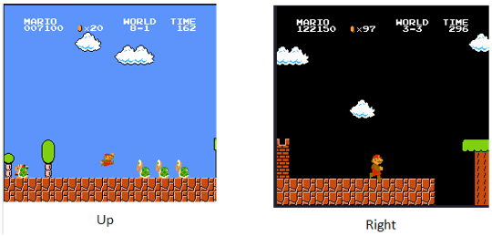

# Super Mario Play
In this project we take the abilities of Deep Neural Networks (DNN) and put it into use in the world of gaming. We classified key presses on a given pre-labeled dataset to learn the game.


Inspired by OpenAI's paper on videogames-pre-training found [here](https://openai.com/research/vpt)


## Dataset
We took the labeled dataset at [Mario Dataset](https://github.com/rafaelcp/smbdataset) that has the following key-action mapping:


The dataset is divided in the following form: 

```bash
Folder: <user>_<sessid>_e<episode>_<world>-<level>_<outcome>

Frame: <user>_<sessid>_e<episode>_<world>-<level>_f<frame>_a<action>_<datetime>.<outcome>.png
```
where action is a number that needs to be converted into 8bits when each bit represents a key.

## Classifier
### Training
We trained a classifier based on ResNet18 architecture with BCE loss .The following set of parameters was used in the training process:

| Parameter             | Value |
|-----------------------|-------|
| Batch size            | 128   |
| Number of epochs      | 7     |
| Group size            | 15    |
| Initial learning rate | 1e-3  |
| use_color             | False |
| augmentations         | True  |


* group_size: amount of frames used for a single classification, not causal.
* augmentations: using inversion, gaussian blur, box blur, rotation and erasing from Kornia.

The training uses this set of buttons only: {Up, Left, Right, B}

### How to train

download the dataset from [Mario Dataset](https://github.com/rafaelcp/smbdataset) and extract it to 
``` bash
./mario_dataset
```
We have the following file which you can change the model's path and the parameters listed in the table above.

``` bash
python main_train.py
```

the above method will also save checkpoints in checkpoint folders in model dir.


### Labeling New Video

After training the model it can be used to label a downloaded video.

in the file :
``` bash
dataset_extraction.py
```
you need to change the following configuration that are located in the start of the file(under params section):
| Parameter             | description |
|-----------------------|-------------|
| video_path            | path for video |
| frames_dir            | path to save extracted frames of video |
| start_sec             | cut the first seconds |
| end_sec               | cut the last seconds |
| metadata_path         | where to save the created metdata csv  |
| group_size            | used model group size |
| model path            | trained classifier path |


after setting the parameters run:
```bash
python dataset_extraction.py
```

which will run the video frames extraction and create metadata csv accoring to them and the model.

### dataset extarction function description

the file itself contains 3 functions :
*   `dataset_extraction.py` use to label your own video with these 3 functions:

*   `extract_frames(video_path, frames_dir,start_sec,stop_sec)`: takes your video and decomposes it to frames. 

*   `create_metadata(frames_dir,metadata_path,model,group_size)`: labels the frames based on your model. saves a csv file with the frames titles and labels.
csv head: Up, Left, Right, B, ID, Image_path


## Agent
the agent itself is the same as the classifier (as it also classify between what button to press), only instead of being non causal it can only use the past frames

### Training

The following parameters were used:

| Parameter             | Value |
|-----------------------|-------|
| Batch size            | 128   |
| Number of epochs      | 7     |
| history_size          | 7     |
| Initial learning rate | 1e-3  |
| use_color             | False |
| augmentations         | True  |

* history_size: amount of frames used for a single classification causal and look only it passed frames.
* augmentations: using invertion, gaussian blur, box blur, rotation and erasing from Kornia.

### How to train agent
We have the following file which you can change the model's path and the parameters listed in the table above.

``` bash
python main_train_agent.py
```

it will save checkpoints the same way as the calssifier.

### Testing in openai gym

first a fix needs to be made (bug in openai gym) , use the following link to apply the fix:
[fix](https://stackoverflow.com/questions/74060371/gym-super-mario-bros-7-3-0-valueerror-not-enough-values-to-unpack-expected)

after that simply run :
```bash
python main_gym_agent_play.py
```

* in order to render live uncomment the line : env.render()

# Prerequisites
Package                  | Version
------------------------ | -------------
byol-pytorch             | 0.6.0
gym                      | 0.26.2
gym-notices              | 0.0.8
gym-super-mario-bros     | 7.3.0
numpy                    | 1.24.3
torch                    | 2.0.1
torchaudio               | 2.0.2
torchvision              | 0.15.2
tqdm                     | 4.65.0
 
* if using gym use the fix mention in agent running section

## Files in the repository (helper_code)

|File name         | Purpsoe |
|----------------------|------|
|`train.py`| define the train loop for both models|
|`resnet_model.py`| define the model archtecture change for both models (has hyperparameters of resnet type, group size and color)|
|`mario_history_dataset.py`| pytorch dataset object for the dataset extraction scripy output. also has implimantation for smb dataset for only history group|
|`mario_buttons_dataset.py`| pytorch dataset object for smb dataset (for classifier)|
|`eval_model.py`| code for evaluaing model performence|

# Reference
[1] Baker, Bowen, Ilge Akkaya, Peter Zhokhov, Joost Huizinga, Jie Tang, Adrien Ecoffet, Brandon Houghton, Raul Sampedro, and Jeff Clune. 2022. Video pretraining (vpt): learning to act by watching unlabeled online videos. arXiv: 2206.11795 [cs.LG].

[2] Pinto, R.C. 2021. Super mario bros. gameplay dataset. https://github.com/rafaelcp/smbdataset.
